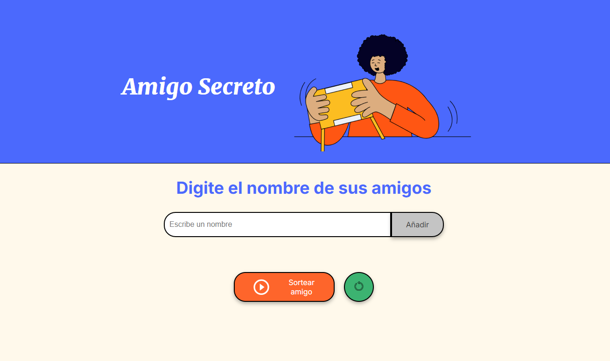

# Proyecto: Amigo Secreto

Este proyecto es una implementación simple de la aplicación "Amigo Secreto". Permite a los usuarios ingresar los nombres de sus amigos, realizar un sorteo para elegir al ganador y reiniciar la lista de amigos cuando sea necesario.

## Funciones del Proyecto

### 1. **Agregar un amigo a la lista**
   - El usuario puede escribir el nombre de un amigo en un campo de texto.
   - El código valida que el nombre no esté vacío, no contenga números, y solo tenga letras y espacios.
   - Si el nombre es válido, se agrega a una lista visual en la página.

### 2. **Sortear un amigo secreto**
   - Si tienes al menos dos amigos en la lista, puedes hacer un sorteo para elegir al ganador de manera aleatoria.
   - El resultado aparece en la página indicando quién es el ganador.

### 3. **Reiniciar la lista**
   - Si deseas reiniciar el sorteo y borrar la lista de amigos, puedes hacerlo mediante el botón de "resetear".

## Detalles del Código

### **HTML (estructura de la página)**
   - La página está estructurada con una sección principal que incluye un título, una imagen, un área para ingresar los nombres de los amigos y dos botones para realizar el sorteo y reiniciar la lista.
   - Los nombres ingresados se muestran en una lista (ul) que se actualiza dinámicamente a medida que se agregan nombres.
   - El resultado del sorteo también se muestra en una lista separada en la página.

### **CSS (estilos de la página)**
   - Los estilos están definidos en el archivo `style.css` para darle un diseño limpio y atractivo a la página.
   - Se usan fuentes de Google Fonts para mejorar la legibilidad.

### **JavaScript (funcionalidad)**
   - **Función `agregarAmigo`**: Esta función se activa cuando el usuario hace clic en el botón "Añadir". Toma el nombre ingresado, lo valida y lo agrega a la lista si es correcto.
     - Si el nombre ya está en la lista, muestra un mensaje de alerta.
     - Si el nombre contiene números o caracteres no permitidos, muestra un mensaje de alerta y limpia el campo de texto.
     - Si todo está bien, el nombre se agrega a la lista y se muestra en la interfaz.
   - **Función `sortearAmigo`**: Esta función se activa cuando el usuario hace clic en el botón "Sortear amigo". Si la lista tiene al menos dos amigos, selecciona aleatoriamente uno de ellos como el ganador y lo muestra en la página.
   - **Función `reiniciarSorteo`**: Esta función se activa cuando el usuario hace clic en el botón "resetear". Limpia la lista de amigos y el resultado del sorteo.

## Explicación de la Lógica

1. **Validación del nombre**: Antes de agregar un amigo a la lista, se realiza una validación para asegurarse de que el nombre es válido:
   - Si el campo está vacío, se muestra una alerta.
   - Si el nombre contiene números, también se muestra una alerta y se limpia el campo de texto.
   - Si el nombre ya está en la lista, se muestra una alerta.
   - Solo se permiten letras y espacios.
   
2. **Sorteo Aleatorio**: Para elegir un amigo secreto de manera aleatoria, se utiliza `Math.random()` junto con `Math.floor()` para seleccionar un índice al azar de la lista de amigos.

3. **Interactividad**: Los botones de "Añadir", "Sortear" y "Resetear" están conectados con las funciones correspondientes que modifican la interfaz de usuario según las acciones del usuario.

## Consideraciones

- El código está diseñado para ser lo más simple y entendible posible, para que sea fácil de modificar o extender en el futuro.
- No se incluyeron demasiados comentarios porque el código es intuitivo y los nombres de las funciones y variables son claros, pero si es necesario, se pueden agregar más comentarios.

---

¡Si tienes alguna pregunta o necesitas más detalles, no dudes en preguntar!
